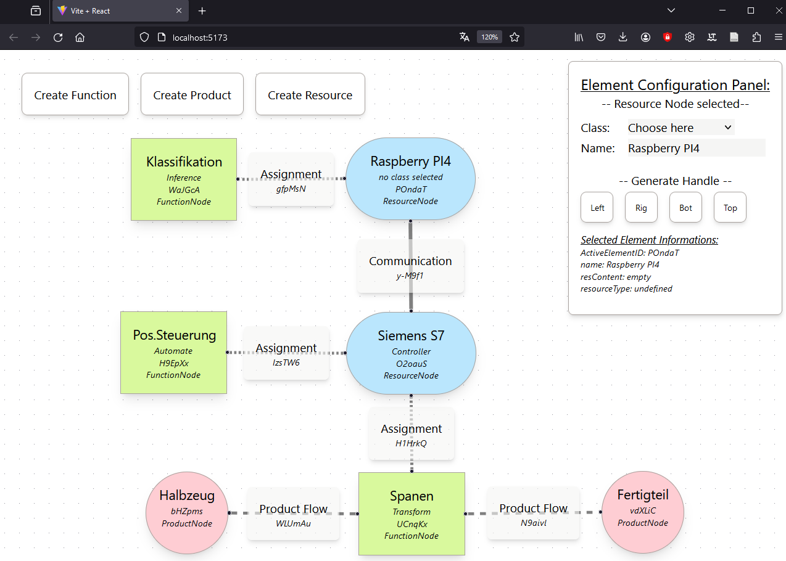
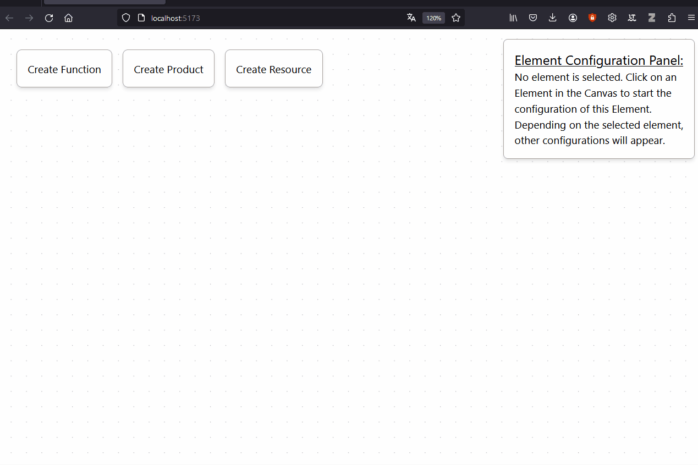
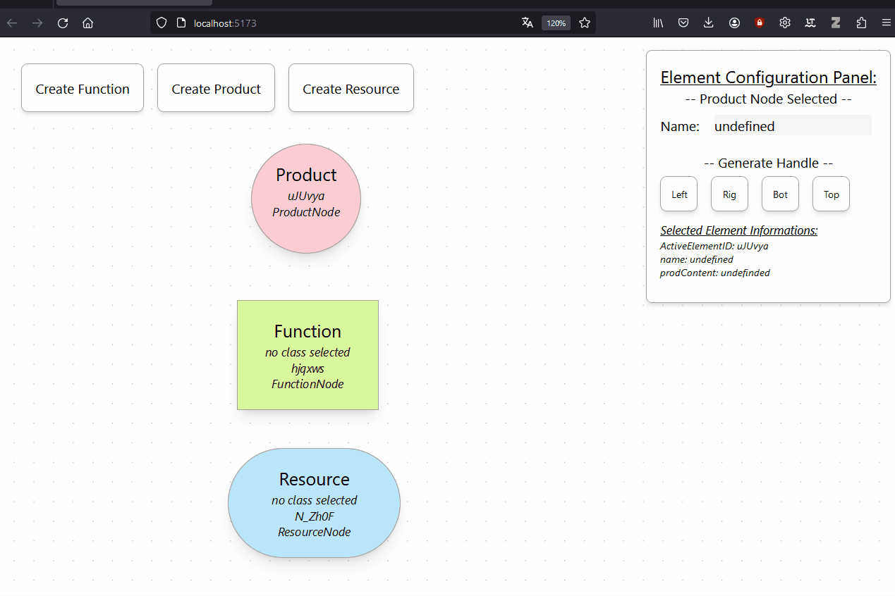
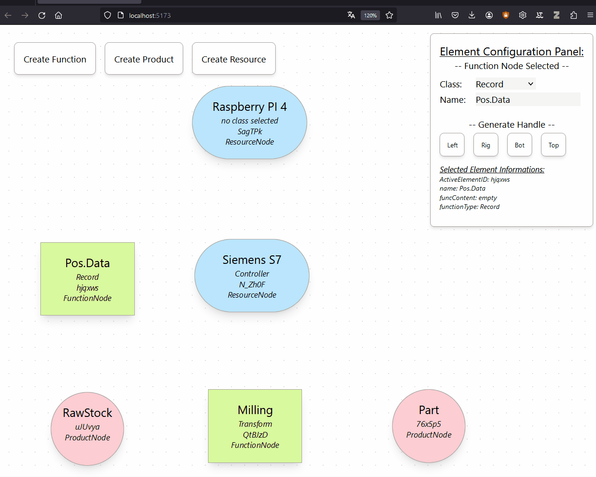

# Web-based Tool for Mode-Based Engineering of AI-Applications for Automation Systems
The ai-modeling-tool is an interactive, easy-to-use and open source web-tool to graphical model ai applications for automations systems conceptually.

> [!CAUTION]
> This project is still in very early stages of development. Use at your own risk.

## Motivation and Introduction
Accordingly, there is a lack of a solution approach that allows industry to independently model AI applications for automation systems, including the underlying manufacturing or procedural process, and to coordinate their development on the basis of the model.

The ai-modling-tool in this repository addresses the identified lack and presents a web-based solution concept. This is based on the combination of the *Graphical Modeling Language for Automation Systems (GML-AIAAS)* according to Schieseck et al.[^1] and the  *Data mining methodology for engineering applications (DMME)* according to Huber et al.[^2]. Both are integrated and transferred into a web-based tool for graphical modeling. This is done according to the principle of combining a graphical modeling approach, a method and a tool presented by Schnieder[^3].

For further details to the underlying modeling language named *GML-AIAAS* please visit [Schieseck et al.](https://github.com/schiesem/GML-AIAAS) or read the [conference paper](https://arxiv.org/abs/2306.11767) or the [prePrint](https://www.researchgate.net/publication/373327442_A_Graphical_Modeling_Language_for_Artificial_Intelligence_Applications_in_Automation_Systems).

For further details to the underlying method DMME please read the [conference paper](https://www.researchgate.net/publication/331723990_DMME_Data_mining_methodology_for_engineering_applications_-_a_holistic_extension_to_the_CRISP-DM_model).

[^1]: Schieseck, M.; Topalis, P.; Fay, A.: A Graphical Modeling Language for Artificial Intelligence Applications in Automation Systems. In: 2023 IEEE 21st International Conference on Industrial Informatics (INDIN). Lemgo, DE, 2023.
[^2]: Huber, S.; Wiemer, H.; Schneider, D.; Ihlenfeldt, S.: DMME: Data mining methodology for engineering applications–a holistic extension to the CRISP-DM model. Procedia CIRP 79/, S. 403–408, 2019.
[^3]: Schnieder, E.: Methoden der Automatisierung. Vieweg+Teubner Verlag, Wiesbaden, 1999.

## AI-Modeling-Tool
The tool allows an interactive modeling of ai applications for automation systems based on the graphical modeling language of [Schieseck et al.](https://github.com/schiesem/GML-AIAAS). The graphical user interface of the tool is shown in Fig. 1. The buttons *Create Function*, *Create Product* and *Create Resource* allow to add elements to the interface. An element can be selected with a mouse click. A selected Element can be configured via the *Configuration menu* in the top right corner. The four buttons in the configuration menu can be used to add interfaces to the selected element at the corresponding position *left, right, top, bot*. Different elements can be connected to each other via these interfaces using drag-and-drop.

| |
|:--:|
| Fig. 1: Graphical Use-Interface with an Example Use-Case |

## Usage and Functions of the AI-Modeling-Tool
In the following the functions of the tool are presented.

### Creating Elements
You can use the three Buttons up left in the so called "creation panel" to create new Elements.

| |
|:--:|
| Fig. 1: Creation of new Elements |

### Configure Elements
You can use the so called "configuration panel" up right to configure the created elements. Depending on the selected element, different configuration possible configuration elements are changing.

| |
|:--:|
| Fig. 2: Configuration of created elements |

### Connect Elements
You can connected different elements by first adding a handle as interface and then connecting via drag-and-drop. Depending on the target and source element type (Function, Product, Resource) a different connection is automatically chosen.

| |
|:--:|
| Fig. 3: Configuration of created elements |

## Local Deployment and Setup
 Node.JS is required for deploying and using the AI-Modeling-Tool. The modeling tool is based on React and [ReactFlow](https://reactflow.dev/). It is also recommended to use an IDE such as Visual Studio Code to execute the commands for installing and starting in development mode. We recommend the following steps for the local deployment:

1. Clone or download this repository. If you have downloaded the repository, you must unpack the zip-compressed file on your local storage.
2. Navigate in the Terminal to the root folder.
3. To install the required dependencies, execute the command:

   `npm install`

4.  To start the ai-modeling-tool, execute the command in the terminal:

   `npm run dev`  
   
5. You have access to the ai-modeling-tool user interface in the web-browser with:.

   `localhost:5173`

## How to cite


This tool has been published in a conference paper. You can find this paper on [ResearchGate](https://www.researchgate.net/publication/387162832_Webbasiertes_Werkzeug_fur_das_modellbasierte_Engineering_von_KI-Anwendungen_fur_Automatisierungssysteme) or [here](https://opendata.uni-halle.de//handle/1981185920/118011). Feel free to contact us via ResearchGate in case you have questions about the paper.
In case you want to use this tool in your own research, please cite as:
```
M. Schieseck, P. Topalis, A. Fay: Webbasiertes Werkzeug für das modellbasierte Engineering von KI-Anwendungen für Automatisierungssysteme. In:
18. Fachtagung Entwurf komplexer Automatisierungssysteme (EKA). Magdeburg, DE, 2024.
```
If you are using a BiBTex-file, you can copy the following:
```
@inProceedings{schieseck2024ai-modeling-tool,
  author={Schieseck, Marvin and Topalis, Philip and Fay, Alexander},
  booktitle={18. Fachtagung Entwurf komplexer Automatisierungssysteme (EKA)},
  title={Webbasiertes Werkzeug für das modellbasierte Engineering von KI-Anwendungen für Automatisierungssysteme},
  address = {Magdeburg, DE},
  year={2024}
}
```

   
